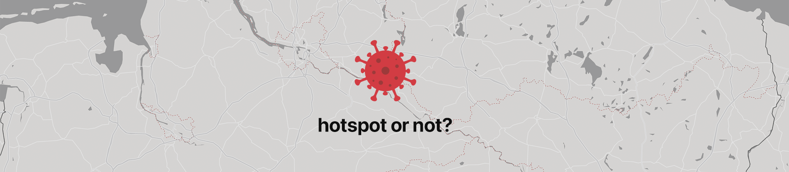
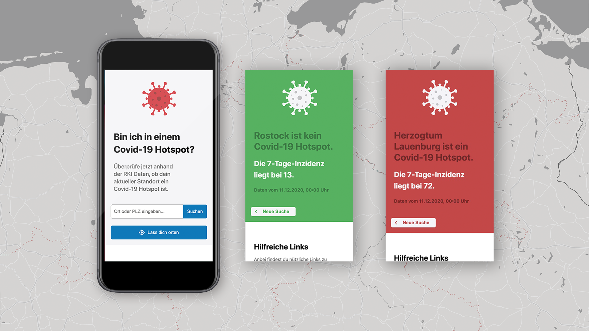

"hotspot or not" is a browser app to check the covid-19 incidence rate of your area or other places in germany, based on the data of the Robert Koch Institute.

 

## Motivation

Since the covid-19 pandemic started, there is no easy way to check the incidence rate of your area fast and uncomplicated. But that is the perfect indicator to get an impression how the virus is spreading.
As the german government published the rules about covid-19 hotspots and the definition of them, the idea was born to create a simple web tool for easy checking, if an area is a "hotspot or not?".

This idea was originally created together with two friends and deployed at [hotspotornot.de](https://hotspotornot.de) during my early time at "Neue Fische". Therefore just a small part of coding was covered by me. After getting through the learning part of the bootcamp, I decided to code the whole idea alone from scratch as part of my graduation.

 

 

## Tech Stack

-   React
-   React Router
-   React Hooks
-   REST-API
-   Styled Components
-   Styleguidist
-   React Testing Library
-   JEST
-   Cypress
-   Adobe XD

 

**API Reference**

-   [Geocoding Nominatim API](https://nominatim.org/)

-   [NPGEO RKI COVID-19 API](https://npgeo-corona-npgeo-de.hub.arcgis.com/datasets/dd4580c810204019a7b8eb3e0b329dd6_0)

 

---

## How to use?

 

`$ npm install`

Installs all packages.

`$ npm test`

Verify that the project runs without errors.

`$ npm run styleguide`

See the styleguidist

`$npm run build`

Builds the app for production to the `build` folder.\
It correctly bundles React in production mode and optimizes the build for the best performance.

The build is minified and the filenames include the hashes. The app is ready to be deployed!

### **Client**

`$ npm start`

Runs the app in the development mode.\
Open [http://localhost:3000](http://localhost:3000) to view it in the browser.

---

## License

[MIT](https://en.wikipedia.org/wiki/MIT_License#License_terms)

---

Thanks for this intense and great time and for all your support!\
[neuefische GmbH ](https://github.com/neuefische)
